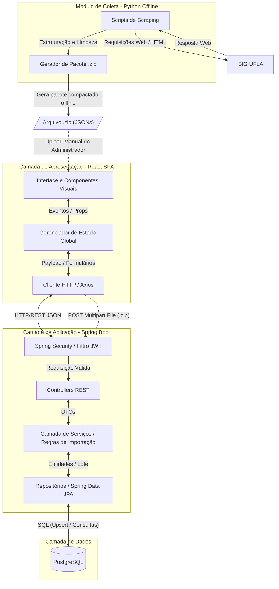

# 8 Arquitetura do Sistema
## 1. Visão Arquitetural e Organização Estrutural

A arquitetura do **gradeUFLA** baseia-se no estilo **Cliente-Servidor (Client-Server)** distribuído, integrado a um processo de ingestão de dados em lote (*Batch Processing*) operado offline. O ecossistema é composto por uma **Single Page Application (SPA)** no Front-end, uma **API RESTful** estruturada no Back-end e um **Script Autônomo Offline** focado na extração e estruturação de dados (*Web Scraping*) em Python.

Esta abordagem garante o isolamento de responsabilidades (Separação de Interesses) e viabilidade financeira, permitindo que a interface interativa, as regras de negócio e o processamento pesado de extração de dados operem em ambientes e momentos distintos, garantindo alta escalabilidade.

### 1.1 Diagrama de Arquitetura

---

## 2. Componentes, Camadas e Responsabilidades

A estrutura da aplicação web está segmentada nos seguintes módulos:

| Camada/Módulo | Componente Principal | Responsabilidade |
| --- | --- | --- |
| **Apresentação (Front-end)** | React (JS/TS) | Renderizar a interface interativa (SPA), gerenciar eventos do utilizador (ex: *drag-and-drop* na montagem da grade), fornecer a interface de upload do `.zip` e validar lógicas visuais de conflitos no lado do cliente. |
| **Aplicação (Back-end)** | Spring Boot (Java) | Expor *endpoints* RESTful seguros, orquestrar a descompactação e processamento do pacote de dados `.zip` e centralizar validações críticas de negócio. |
| **Segurança (Back-end)** | Spring Security | Intercetar requisições HTTP para rotas administrativas, validar e decodificar tokens JWT e gerir o controlo de acessos (Autenticação e Autorização). |
| **Acesso a Dados (Back-end)** | Spring Data JPA / Hibernate | Isolar a complexidade do banco de dados, efetuando as inserções em lote (*Upsert*) e mapeando objetos Java para registos relacionais através de consultas otimizadas. |
| **Automação (Bot Offline)** | Python (Scraping Scripts) | Obter acesso ao SIG da UFLA a partir da máquina local do administrador, raspar o código HTML, estruturar as informações em JSONs e compactá-las em um arquivo `.zip`. |
| **Persistência (Banco)** | PostgreSQL | Armazenar dados estáticos e dinâmicos (cursos, disciplinas, turmas, pré-requisitos), credenciais administrativas e *logs* de acesso de forma normalizada. |

---

## 3. Comunicação entre as Partes do Sistema

A comunicação entre os componentes estruturais do sistema obedece aos seguintes protocolos e formatos:

* **Front-end ↔ Back-end (Uso Geral):** Comunicação síncrona via protocolo HTTP/HTTPS utilizando o padrão arquitetural REST. Os dados transitam exclusivamente em formato JSON (*Payloads* e DTOs). O Front-end anexa o token JWT no cabeçalho ao solicitar rotas administrativas.
* **Front-end ↔ Back-end (Importação):** Para atualização da base, o Front-end envia o arquivo compactado via requisição HTTP utilizando o formato `multipart/form-data`.
* **Back-end ↔ Banco de Dados:** Comunicação via protocolo TCP/IP. O Spring Data JPA traduz as invocações de métodos em comandos SQL estritos.
* **Bot Automação ↔ SIG UFLA:** Comunicação assíncrona baseada em requisições HTTP (GET/POST) efetuadas localmente. O bot efetua a extração interpretando o DOM retornado em HTML e gera um artefato físico local (`.zip`), sem comunicação direta com a API web.

---

## 4. Justificativa Técnica da Arquitetura Adotada

* **Separação em Camadas (MVC/REST no Back-end):** A divisão estrita entre *Controllers*, *Services* e *Repositories* no Spring Boot impede o vazamento de lógica de negócio para a interface web. Se a base de dados mudar, apenas o *Repository* sofre impacto; se as regras de importação mudarem, altera-se o *Service*.
* **Delegação de Processamento ao Front-end:** Decidiu-se manter as validações de conflito de horários e os cálculos de créditos localmente (no *browser* via React). Esta escolha minimiza drasticamente a latência percebida pelo estudante e reduz a carga no servidor, garantindo uma resposta em tempo real.
* **Módulo de Automação Offline (Pivot Estratégico):** O *web scraping* em navegadores ocultos consome memória RAM excessiva. Em vez de acoplar o *scraper* ao servidor web (encarecendo os custos de hospedagem na nuvem), optou-se por um ambiente Python rodando offline. O administrador gera o `.zip` localmente e envia para a API. Este isolamento blinda a aplicação: mesmo se o SIG mudar ou o script falhar, o servidor web não é impactado e o GradeUFLA continua 100% online servindo os dados consolidados no banco.

---

## 5. Relação com Requisitos e Atributos de Qualidade

As escolhas arquiteturais mapeiam-se diretamente para os atributos de qualidade e requisitos estabelecidos e refinados ao longo das *sprints*:

| Atributo de Qualidade | Decisão Arquitetural Mapeada | Justificativa / Impacto |
| --- | --- | --- |
| **Performance e Escalabilidade** | Arquitetura Cliente-Servidor com validações locais (*Client-side*). | Previne sobrecarga (gargalos) na API durante a semana de matrícula (alta concorrência). Apenas a carga inicial de disciplinas bate no servidor. |
| **Disponibilidade e Custos (RNF08)** | Isolamento do Bot para processamento offline (via upload de `.zip`). | Elimina o risco de o servidor web cair por falta de RAM durante o *scraping*, reduzindo custos de infraestrutura e imunizando o sistema contra falhas de conexão no SIG. |
| **Segurança (RNF05/07)** | Intercetadores Spring Security e encriptação *BCrypt* de passwords. | Garante que o painel de controlo, a importação de arquivos e os *logs* (Analytics) estejam blindados contra acessos não autorizados. |
| **Usabilidade (RF)** | SPA com React e gerência de estado (Zustand/Redux/Context). | Proporciona uma experiência fluida, reativa e sem necessidade de recarregamentos de página (*reloads*) constantes ao arrastar matérias. |
