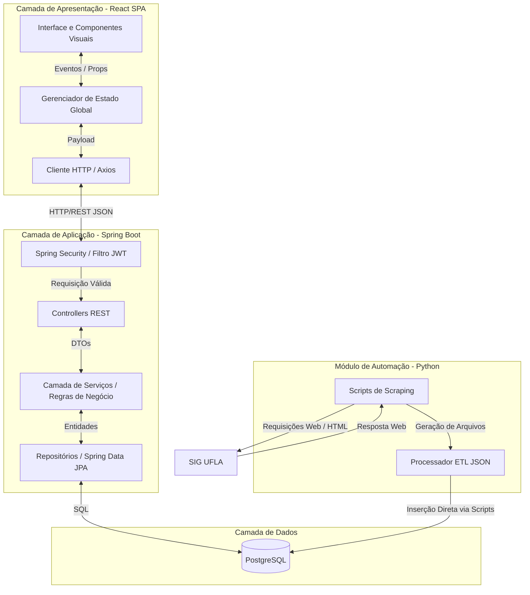

# Arquitetura do Sistema (Sprint 6)

## 1. Visão Arquitetural e Organização Estrutural

A arquitetura do **gradeUFLA** baseia-se no estilo **Cliente-Servidor (Client-Server)** distribuído, operando em múltiplas camadas lógicas. O ecossistema é composto por uma **Single Page Application (SPA)** no Front-end, uma **API RESTful** estruturada no Back-end e um **Microsserviço Autônomo** focado na extração e integração de dados (*Web Scraping*) em python.

Esta abordagem garante o isolamento de responsabilidades (Separação de Interesses), permitindo que a interface interativa, as regras de negócio de segurança e o processamento pesado de dados evoluam e escalem de forma independente.

### 1.1 Diagrama de Arquitetura



---

## 2. Componentes, Camadas e Responsabilidades

A estrutura da aplicação web está segmentada nos seguintes módulos:

| Camada/Módulo | Componente Principal | Responsabilidade |
| --- | --- | --- |
| **Apresentação (Front-end)** | React (JS/TS) | Renderizar a interface interativa (SPA), gerenciar eventos do utilizador (ex: *drag-and-drop* na montagem da grade) e validar lógicas visuais e conflitos no lado do cliente. |
| **Aplicação (Back-end)** | Spring Boot (Java) | Expor *endpoints* RESTful seguros para consumo do Front-end e centralizar validações críticas de negócio e segurança. |
| **Segurança (Back-end)** | Spring Security | Intercetar requisições HTTP para rotas administrativas, validar e decodificar tokens JWT e gerir o controlo de acessos (Autenticação e Autorização). |
| **Acesso a Dados (Back-end)** | Spring Data JPA / Hibernate | Isolar a complexidade do banco de dados, mapeando objetos Java (Entidades) para registos relacionais através de consultas otimizadas. |
| **Automação (Bot)** | Python (Scraping Scripts) | Obter acesso ao SIG da UFLA periodicamente, raspar o código HTML, limpar e estruturar as informações em um arquivo JSON e injetá-las no banco de dados. |
| **Persistência (Banco)** | PostgreSQL | Armazenar dados estáticos (cursos, disciplinas, turmas, pré-requisitos), credenciais administrativas e *logs* de acesso de forma normalizada. |

---

## 3. Comunicação entre as Partes do Sistema

A comunicação entre os componentes estruturais do sistema obedece aos seguintes protocolos e formatos:

* **Front-end ↔ Back-end:** Comunicação síncrona via protocolo HTTP/HTTPS utilizando o padrão arquitetural REST. Os dados transitam exclusivamente em formato JSON (*Payloads* e DTOs). O Front-end anexa o token JWT no cabeçalho ao solicitar rotas administrativas.
* **Back-end ↔ Banco de Dados:** Comunicação via protocolo TCP/IP. O Spring Data JPA traduz as invocações de métodos em comandos SQL estritos.
* **Bot Automação ↔ SIG UFLA:** Comunicação assíncrona baseada em requisições HTTP (GET/POST) simulando navegação humana. O bot efetua a extração interpretando o DOM retornado em HTML.
* **Bot Automação ↔ Banco de Dados:** Conexão direta via conectores Python para executar rotinas de inserção massiva (ETL) e atualizar o painel de controlo administrativo.

---

## 4. Justificativa Técnica da Arquitetura Adotada

* **Separação em Camadas (MVC/REST no Back-end):** A divisão estrita entre *Controllers*, *Services* e *Repositories* no Spring Boot impede o vazamento de lógica de negócio para a interface web. Se a base de dados mudar, apenas o *Repository* sofre impacto; se as regras mudarem, altera-se o *Service*.
* **Delegação de Processamento ao Front-end:** Decidiu-se manter as validações de conflito de horários e os cálculos de créditos localmente (no *browser* via React). Esta escolha minimiza drasticamente a latência percebida pelo estudante e reduz a carga no servidor, garantindo uma resposta em tempo real.
* **Módulo de Automação Autônomo:** Em vez de construir o *scraper* dentro do servidor web (Java), optou-se por um ambiente Python isolado. O *web scraping* consome muita memória e é suscetível a instabilidades no site de origem (SIG). Este isolamento blinda a API principal: mesmo se o processo de extração falhar (ex: mudança no HTML do SIG), o GradeUFLA continua 100% online a servir os dados da última atualização bem-sucedida.

---

## 5. Relação com Requisitos e Atributos de Qualidade

As escolhas arquiteturais mapeiam-se diretamente para os atributos de qualidade e requisitos estabelecidos nas *sprints* iniciais:

| Atributo de Qualidade | Decisão Arquitetural Mapeada | Justificativa / Impacto |
| --- | --- | --- |
| **Performance e Escalabilidade** | Arquitetura Cliente-Servidor com validações locais (*Client-side*). | Previne sobrecarga (gargalos) na API durante a semana de matrícula (alta concorrência). Apenas a carga inicial de disciplinas bate no servidor. |
| **Disponibilidade (RNF08)** | Isolamento do Bot de *Scraping* e cache de dados no PostgreSQL. | O sistema não depende de conexão ativa ou estabilidade do SIG UFLA para permitir aos estudantes a montagem de grade. |
| **Segurança (RNF05/07)** | Intercetadores Spring Security e encriptação *BCrypt* de passwords. | Garante que o painel de controlo, *logs* (Analytics) e gatilhos de dados estejam blindados contra acessos anónimos. |
| **Usabilidade (RF)** | SPA com React e gerência de estado baseada no padrão Observer. | Proporciona uma experiência fluida, reativa e sem necessidade de recarregamentos de página (*reloads*) constantes ao arrastar matérias. |

```

```
